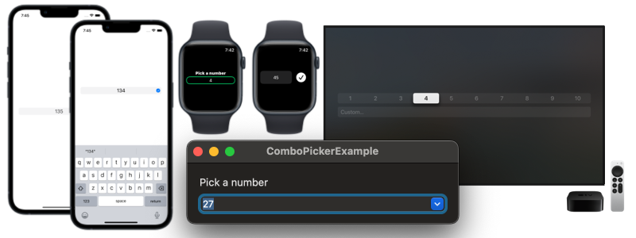

# ComboPicker

ComboPicker is a SwiftUI view that allows users to input a value by selecting from a predefined set or by typing a custom one.



## Installation
ComboPicker is available through [Swift Package Manager](https://swift.org/package-manager).

```swift
.package(url: "https://github.com/MrAsterisco/ComboPicker", from: "<see GitHub releases>")
```

### Latest Release
To find out the latest version, look at the Releases tab of this repository.

## Usage
ComboPicker can display any type that conforms to the `ComboPickerModel` protocol. The following example shows a model that wraps a `Int`:

```swift
public struct ExampleModel: ComboPickerModel {
  public let id = UUID()
  public let value: Int
  
  // Default initializer.
  public init(value: Int) {
    self.value = value
  }
  
  // Initializer to convert user input into a value.
  public init?(customValue: String) {
    guard let doubleValue = NumberFormatter().number(from: customValue)?.intValue else { return nil }
    self.init(value: doubleValue)
  }
  
  // Convert the value to prefill the manual input field.
  public var valueForManualInput: String? {
    NumberFormatter().string(from: .init(value: value))
  }
  
  // Value display label.
  public var label: String {
    "# \(NumberFormatter().string(from: .init(value: value)) ?? "")"
  }
}
```

Once you have a collection of models, displaying them in the `CombPicker` is easy:

```swift
@State private var content: [ExampleModel]
@State private var selection: ExampleModel

ComboPicker(
  title: "Pick a number",
  manualTitle: "Custom...",
  content: $content,
  value: $selection
)
```

## Platform Behaviors
`ComboPicker` adapts to the platform to provide an easy and accessible experience regardless of the device.

### iOS & iPadOS
On iOS and iPadOS, the `ComboPicker` shows a one-line `Picker` that the user can scroll. If the user taps on it, a text field for manual input appears.


If necessary, you can customize the keyboard type for the manual input field:

```swift
.keyboardType(.numberPad)
```

### watchOS
On watchOS, the `ComboPicker`shows a normal `Picker` that the user can scroll using their fingers or the digital crown. If the user taps on it, a text field for manual input appears.


There is no support for specifying the keyboard type, at the moment, as Apple doesn't provide a way to do so on watchOS.

### macOS
On macOS, the `ComboPicker` becomes an `NSComboBox`. Users will be able to select options or type custom ones directly into the component.

See the [Apple docs](https://developer.apple.com/design/human-interface-guidelines/components/selection-and-input/combo-boxes) for further information on how combo boxes work.

### tvOS
On tvOS, the `ComboPicker` shows a `Picker` followed by a `TextField`. The user can move on the picker or scroll down to the text field and input a custom value.


If necessary, you can customize the keyboard type for the manual input field:

```swift
.keyboardType(.numberPad)
```
## Compatibility
ComboPicker requires **iOS 15.0 or later**, **macOS 12.0 or later**, **watchOS 8.0 or later** and **tvOS 15.0 or later**.

## Contributions
All contributions to expand the library are welcome. Fork the repo, make the changes you want, and open a Pull Request.

If you make changes to the codebase, I am not enforcing a coding style, but I may ask you to make changes based on how the rest of the library is made.

## Status
This library is under **active development**. Even if most of the APIs are pretty straightforward, **they may change in the future**; but you don't have to worry about that, because releases will follow [Semantic Versioning 2.0.0](https://semver.org/).

## License
ComboPicker is distributed under the MIT license. [See LICENSE](https://github.com/MrAsterisco/ComboPicker/blob/master/LICENSE) for details.
